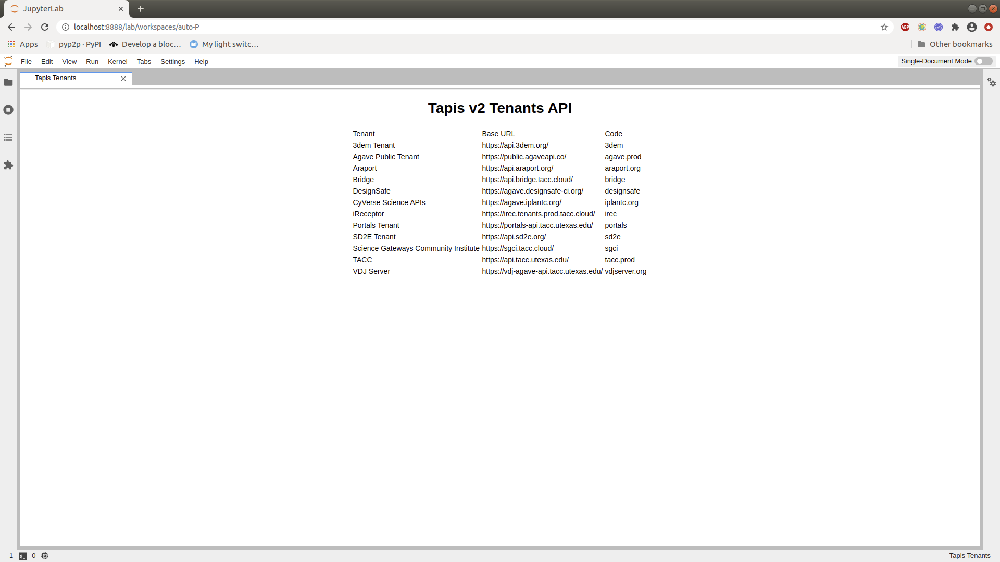
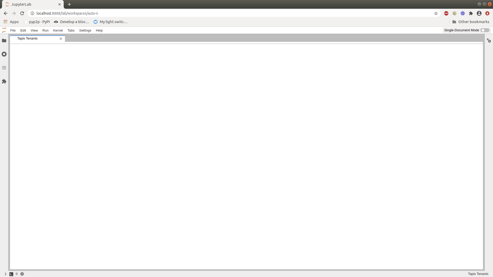

.. _extension_tutorial:

Let's Make a Tapis v2 Tenants JupyterLab Extension
----------------------------------------------------------------

JupyterLab extensions add features to the user experience. This page
describes how to create one type of extension, an *application plugin*,
that:

-  Adds a "Tapis v2 Tenants" command to the
   *command palette* sidebar
-  Fetches the metadata when activated
-  Shows the metadata in a tab panel

By working through this tutorial, you'll learn:

-  How to set up an extension development environment from scratch on a
   Linux or OSX machine. (You'll need to modify the commands slightly if you are on Windows.)
-  How to start an extension project from
   `jupyterlab/extension-cookiecutter-ts <https://github.com/jupyterlab/extension-cookiecutter-ts>`__
-  How to iteratively code, build, and load your extension in JupyterLab
-  How to version control your work with git
-  How to release your extension for others to enjoy

   The completed extension, displaying all Tapis v2 Tenants.

Sound like fun? Excellent. Here we go!

Set up a development environment
~~~~~~~~~~~~~~~~~~~~~~~~~~~~~~~~

Install conda using miniconda
^^^^^^^^^^^^^^^^^^^^^^^^^^^^^

Start by installing miniconda, following
`Conda's installation documentation <https://docs.conda.io/projects/conda/en/latest/user-guide/install/index.html>`__.

.. _install-nodejs-jupyterlab-etc-in-a-conda-environment:

Install NodeJS, JupyterLab, etc. in a conda environment
^^^^^^^^^^^^^^^^^^^^^^^^^^^^^^^^^^^^^^^^^^^^^^^^^^^^^^^

Next create a conda environment that includes:

1. the latest release of JupyterLab
2. `cookiecutter <https://github.com/audreyr/cookiecutter>`__, the tool
   you'll use to bootstrap your extension project structure (this is a Python tool
   which we'll install using conda below).
3. `NodeJS <https://nodejs.org>`__, the JavaScript runtime you'll use to
   compile the web assets (e.g., TypeScript, CSS) for your extension
4. `git <https://git-scm.com>`__, a version control system you'll use to
   take snapshots of your work as you progress through this tutorial

It's a best practice to leave the root conda environment (i.e., the environment created
by the miniconda installer) untouched and install your project-specific
dependencies in a named conda environment. Run this command to create a
new environment named ``tapis-v2-tenants-ext``.

.. code:: bash

    conda create -n tapis-v2-tenants-ext --override-channels --strict-channel-priority -c conda-forge -c anaconda cookiecutter nodejs git

Now activate the new environment so that all further commands you run
work out of that environment.

.. code:: bash

    conda activate tapis-v2-tenants-ext

Note: You'll need to run the command above in each new terminal you open
before you can work with the tools you installed in the
``tapis-v2-tenants-ext`` environment.

Now we can install the latest version of JupyterLab.

.. code:: bash

    pip install jupyterlab --pre

Create a repository
~~~~~~~~~~~~~~~~~~~

Create a new repository for your extension (see, for example, the
`GitHub instructions <https://help.github.com/articles/create-a-repo/>`__. This is an
optional step, but highly recommended if you want to share your
extension.

Create an extension project
~~~~~~~~~~~~~~~~~~~~~~~~~~~

Initialize the project from a cookiecutter
^^^^^^^^^^^^^^^^^^^^^^^^^^^^^^^^^^^^^^^^^^

Next use cookiecutter to create a new project for your extension.
This will create a new folder for your extension in your current directory.

.. code:: bash

    cookiecutter https://github.com/jupyterlab/extension-cookiecutter-ts --checkout 3.0

When prompted, enter values like the following for all of the cookiecutter
prompts (``apod`` stands for Astronomy Picture of the Day, the NASA service we
are using to fetch pictures).

::

    author_name []: Your Name
    python_name [myextension]: tapis-v2-tenants-ext
    labextension_name [myextension]: tapis-v2-tenants-ext
    project_short_description [A JupyterLab extension.]: Display Tapis v2 tenants api in a JupyterLab panel
    has_server_extension [n]: n
    has_binder [n]: y
    repository [https://github.com/my_name/myextension]: https://github.com/my_name/jupyterlab_apod

Note: if not using a repository, leave the repository field blank. You can come
back and edit the repository field in the ``package.json`` file later.

Change to the directory the cookiecutter created and list the files.

.. code:: bash

    cd tapis-v2-tenants-ext
    ls

You should see a list like the following.

::

    LICENSE          MANIFEST.in      README.md        binder/          jupyterlab_apod/ package.json     pyproject.toml   setup.py         src/             style/           tsconfig.json

Commit what you have to git
^^^^^^^^^^^^^^^^^^^^^^^^^^^

Run the following commands in your ``jupyterlab_apod`` folder to
initialize it as a git repository and commit the current code.

.. code:: bash

    git init
    git add .
    git commit -m 'Seed Tapis Tenants api extension project from cookiecutter'

Note: This step is not technically necessary, but it is good practice to
track changes in version control system in case you need to rollback to
an earlier version or want to collaborate with others. For example, you
can compare your work throughout this tutorial with the commits in a
reference version of ``jupyterlab_apod`` on GitHub at
https://github.com/jupyterlab/jupyterlab_apod.

Build and install the extension for development
^^^^^^^^^^^^^^^^^^^^^^^^^^^^^^^^^^^^^^^^^^^^^^^

Your new extension project has enough code in it to see it working in your
JupyterLab. Run the following commands to install the initial project
dependencies and install the extension into the JupyterLab environment.

.. code:: bash

    pip install -ve .

The above command copies the frontend part of the extension into JupyterLab.
We can run this ``pip install`` command again every time we make a change to
copy the change into JupyterLab. Even better, on Linux or macOS, we can use
the ``develop`` command to create a symbolic link from JupyterLab to our
source directory. This means our changes are automatically available in
JupyterLab:

.. code:: bash

    jupyter labextension develop --overwrite .

See the initial extension in action
^^^^^^^^^^^^^^^^^^^^^^^^^^^^^^^^^^^

After the install completes, open a second terminal. Run these commands to
activate the ``tapis-v2-tenants-ext`` environment and start JupyterLab in your
default web browser.

.. code:: bash

    conda activate tapis-v2-tenants-ext
    jupyter lab

In that browser window, open the JavaScript console
by following the instructions for your browser:

-  `Accessing the DevTools in Google
   Chrome <https://developer.chrome.com/devtools#access>`__
-  `Opening the Web Console in
   Firefox <https://developer.mozilla.org/en-US/docs/Tools/Web_Console/Opening_the_Web_Console>`__

After you reload the page with the console open, you should see a message that says
``JupyterLab extension tapis-v2-tenants-ext is activated!`` in the console.
If you do, congratulations, you're ready to start modifying the extension!
If not, go back make sure you didn't miss a step, and `reach
out <https://github.com/jupyterlab/jupyterlab/blob/master/README.md#getting-help>`__ if you're stuck.

Note: Leave the terminal running the ``jupyter lab`` command open and running
JupyterLab to see the effects of changes below.

Add a Tapis v2 Tenants API widget
~~~~~~~~~~~~~~~~~~~~~~~~~~~~~~~~~~~~~~~~~~

Show an empty panel
^^^^^^^^^^^^^^^^^^^

The *command palette* is the primary view of all commands available to
you in JupyterLab. For your first addition, you're going to add a
*Tapis v2 Tenants* command to the palette and get it to show a tab panel when invoked.

Fire up your favorite text editor and open the ``src/index.ts`` file in your
extension project. Change the import at the top of the file to get a reference
to the command palette interface and the `JupyterFrontEnd` instance.

.. code:: typescript

    import {
      JupyterFrontEnd,
      JupyterFrontEndPlugin
    } from '@jupyterlab/application';

    import { ICommandPalette } from '@jupyterlab/apputils';

Locate the ``extension`` object of type ``JupyterFrontEndPlugin``. Change the
definition so that it reads like so:

.. code:: typescript

    /**
     * Initialization data for the jupyterlab_apod extension.
     */
    const extension: JupyterFrontEndPlugin<void> = {
      id: 'tapis-v2-tenants-ext',
      autoStart: true,
      requires: [ICommandPalette],
      activate: (app: JupyterFrontEnd, palette: ICommandPalette) => {
        console.log('JupyterLab extension tapis-v2-tenants-ext is activated!');
        console.log('ICommandPalette:', palette);
      }
    };

The ``requires`` attribute states that your plugin needs an object that
implements the ``ICommandPalette`` interface when it starts. JupyterLab
will pass an instance of ``ICommandPalette`` as the second parameter of
``activate`` in order to satisfy this requirement. Defining
``palette: ICommandPalette`` makes this instance available to your code
in that function. The second ``console.log`` line exists only so that
you can immediately check that your changes work.

Now you will need to install these dependencies. Run the following commands in the
repository root folder to install the dependencies and save them to your
`package.json`:

.. code:: bash

    jlpm add @jupyterlab/apputils
    jlpm add @jupyterlab/application

Finally, run the following to rebuild your extension.

.. code:: bash

    jlpm run build

.. note::

   This tutorial uses ``jlpm`` to install Javascript packages and
   run build commands, which is JupyterLab's bundled
   version of ``yarn``. If you prefer, you can use another Javascript
   package manager like ``npm`` or ``yarn`` itself.

After the extension build finishes, return to the browser tab that opened when
you started JupyterLab. Refresh it and look in the console. You should see the
same activation message as before, plus the new message about the
ICommandPalette instance you just added. If you don't, check the output of the
build command for errors and correct your code.

::

    JupyterLab extension tapis-v2-tenants-ext is activated!
    ICommandPalette: Palette {_palette: CommandPalette}

Note that we had to run ``jlpm run build`` in order for the bundle to
update. This command does two things: compiles the TypeScript files in `src/`
into JavaScript files in ``lib/`` (``jlpm run build``), then bundles the
JavaScript files in ``lib/`` into a JupyterLab extension in
``tapis-v2-tenants-ext/static`` (``jlpm run build:extension``). If you wish to avoid
running ``jlpm run build`` after each change, you can open a third terminal,
activate the ``tapis-v2-tenants-ext`` environment, and run the ``jlpm run watch``
command from your extension directory, which will automatically compile the
TypeScript files as they are changed and saved.

Now return to your editor. Modify the imports at the top of the file to add a few more imports:

.. code:: typescript

    import { ICommandPalette, MainAreaWidget } from '@jupyterlab/apputils';

    import { Widget } from '@lumino/widgets';

Install this new dependency as well:

.. code:: bash

    jlpm add @lumino/widgets

Then modify the ``activate`` function again so that it has the following
code:

.. code-block:: typescript

      activate: (app: JupyterFrontEnd, palette: ICommandPalette) => {
        console.log('JupyterLab extension jupyterlab_apod is activated!');

        //Create a blank content widget inside of a MainAreaWidget
        const content = new Widget();
        content.addClass('tapis-v2-tenants-widget');
        const widget = new MainAreaWidget({content});
        widget.id = 'tapis-v2-tenants';
        widget.title.label = 'Tapis Tenants';
        widget.title.closable = true;
        
        let header = document.createElement('h1');
        header.innerText = "Tapis v2 Tenants API";
        //content.node.appendChild(header);
    
        let summary = document.createElement('table');
        //content.node.appendChild(summary);
    
        const response = await fetch(`https://api.tacc.utexas.edu/tenants/`);
        if (!response.ok) {
          const data = await response.json();
          if (data.error) {
            summary.innerText = data.error.message;
          } else {
            summary.innerText = response.statusText;
          }
        } else {
          const data = await response.json() as TenantsResponse;
          summary.innerHTML = '<tr><td>Tenant</td><td>Base URL</td><td>Code</td></tr>'
          data.result.forEach(function (value) {
            summary.innerHTML += '<tr><td>' + value.name + '</td><td>' + value.baseUrl + '</td><td>' + value.code + '</td></tr>';
          });
        }
    
    
        //Add an application command
        const command: string = 'tenants:open';
        app.commands.addCommand(command, {
          label: 'Tapis Tenants',
          execute: () => {
            if (!widget.isAttached) {
              //Attach the widget to the main work area if it's not there
              app.shell.add(widget, 'main');
              }
    
              //Activate the widget
              app.shell.activateById(widget.id);
          }
        });
        palette.addItem({command, category: 'Tapis Studio'});
      }

The first new block of code creates a ``MainAreaWidget`` instance with an
empty content ``Widget`` as its child. It also assigns the main area widget a
unique ID, gives it a label that will appear as its tab title, and makes the
tab closable by the user. The second block of code adds a new command with id
``tenants:open`` and label *Tapis Tenants* to JupyterLab. When the
command executes, it attaches the widget to the main display area if it is not
already present and then makes it the active tab. The last new line of code
uses the command id to add the command to the command palette in a section
called *Tutorial*.

Build your extension again using ``jlpm run build`` (unless you are using
``jlpm run watch`` already) and refresh the browser tab. Open the command
palette by clicking on *view* and then *Activate Command Palette* and type *Tapis* in the
search box. Your *Tapis Tenants* command should appear. Click it or
select it with the keyboard and press *Enter*. You should see a new, blank
panel appear with the tab title *Tapis Tenants*. Click the *x* on the tab
to close it and activate the command again. The tab should reappear. Finally,
click one of the launcher tabs so that the *Tapis Tenants* panel is still
open but no longer active. Now run the *Tapis Tenants* command one
more time. The single *Tapis Tenants* tab should come to the foreground.

   The in-progress extension, showing a blank panel.

If your widget is not behaving, compare your code with the reference
project state at the `01-show-a-panel
tag <https://github.com/jupyterlab/jupyterlab_apod/tree/3.0-01-show-a-panel>`__.
Once you've got everything working properly, git commit your changes and
carry on.

.. code-block:: bash

    git add package.json src/index.ts
    git commit -m 'Tapis Tenants command in palette'

Show a picture in the panel
^^^^^^^^^^^^^^^^^^^^^^^^^^^

You now have an empty panel. It's time to add a picture to it. Go back to
your code editor. Uncomment the following code.

.. code-block:: typescript
       
    content.node.appendChild(header);    
    let summary = document.createElement('table');
    
    content.node.appendChild(summary);

Now define the ``TenantsResponse`` type and the other types required to use the response. Put
this definition just under the imports at the top of the file.

.. code-block:: typescript

    interface TenantsResponse {
      status: string;
      message: string;
      result?: (ResultEntity)[] | null;
      version: string;
    }
    interface ResultEntity {
      id: string;
      name: string;
      baseUrl: string;
      code: string;
      contact?: (ContactEntity)[] | null;
      _links: Links;
    }
    interface ContactEntity {
      name: string;
      email: string;
      url: string;
      type: string;
      primary: boolean;
    }
    interface Links {
      self: SelfOrPublickey;
      publickey: SelfOrPublickey;
    }
    interface SelfOrPublickey {
      href: string;
    }

Rebuild your extension if necessary (``jlpm run build``), refresh your browser
tab, and run the *Tapis Tenants* command again. You should now see your Tapis Tenants table populated.

When it's working, make another git commit.

.. code:: bash

    git add src/index.ts
    git commit -m 'Show Tapis Tenants in the panel'

Improve the widget behavior
~~~~~~~~~~~~~~~~~~~~~~~~~~~

Center the image, add attribution, and error messaging
^^^^^^^^^^^^^^^^^^^^^^^^^^^^^^^^^^^^^^^^^^^^^^^^^^^^^^

Open ``style/index.css`` in our extension project directory for editing.
Add the following lines to it.

.. code-block:: css

    .tapis-v2-tenants-widget {
      display: flex;
      flex-direction: column;
      align-items: center;
      overflow: auto;
    }

This CSS stacks content vertically within the widget panel and lets the panel
scroll when the content overflows. This CSS file is included on the page
automatically by JupyterLab because the ``package.json`` file has a ``style``
field pointing to it. In general, you should import all of your styles into a
single CSS file, such as this ``index.css`` file, and put the path to that CSS
file in the ``package.json`` file ``style`` field.

Make sure to check in your code, because you're done!

.. _packaging your extension:

Packaging your extension
~~~~~~~~~~~~~~~~~~~~~~~~

JupyterLab extensions for JupyterLab 3.0 can be distributed as Python
packages. The cookiecutter template we used contains all of the Python
packaging instructions in the ``setup.py`` file to wrap your extension in a
Python package. Before generating a package, we first need to install
``jupyter_packaging``.

.. code:: bash

    pip install jupyter_packaging

To create a Python source package (``.tar.gz``) in the ``dist/`` directory, do:

.. code:: bash

    python setup.py sdist

To create a Python wheel package (``.whl``) in the ``dist/`` directory, do:

.. code:: bash

    python setup.py bdist_wheel

Both of these commands will build the JavaScript into a bundle in the
``tapis-v2-tenants-ext/static`` directory, which is then distributed with the
Python package. This bundle will include any necessary JavaScript dependencies
as well. You may want to check in the ``tapis-v2-tenants-ext/static`` directory to
retain a record of what JavaScript is distributed in your package, or you may
want to keep this "build artifact" out of your source repository history.

You can now try installing your extension as a user would. Open a new terminal
and run the following commands to create a new environment and install your
extension.

.. code:: bash

    conda create -n tapis-v2-tenants-ext jupyterlab
    conda activate tapis-v2-tenants-ext
    pip install tapis-v2-tenants-ext/dist/tapis-v2-tenants-ext-0.1.0-py3-none-any.whl
    jupyter lab

You should see a fresh JupyterLab browser tab appear. When it does,
execute the *Tapis Tenants* command to check that your extension
works.

Publishing your extension
~~~~~~~~~~~~~~~~~~~~~~~~~

You can publish your Python package to the `PyPI <https://pypi.org>`_ or
`conda-forge <https://conda-forge.org>`_ repositories so users can easily
install the extension using ``pip`` or ``conda``.

You may want to also publish your extension as a JavaScript package to the
`npm <https://www.npmjs.com>`_ package repository for several reasons:

1. Distributing an extension as an npm package allows users to compile the
   extension into JupyterLab explicitly (similar to how was done in JupyterLab
   versions 1 and 2), which leads to a more optimal JupyterLab package.

2. As we saw above, JupyterLab enables extensions to use objects provided by
   other extensions. If you want to provide an object to the JupyterLab system
   for other extensions to use, you will need to publish your JavaScript
   package to npm so other extensions can depend on it and import and require
   your token. For example, our extension above uses the ``ICommandPalette``
   and ``ILayoutRestorer`` objects provided by some core extensions in
   JupyterLab. We were able to tell JupyterLab we required these objects by
   importing their tokens from the ``@jupyterlab/apputils`` and
   ``@jupyterlab/application`` npm packages and listing them in our plugin
   definition.
